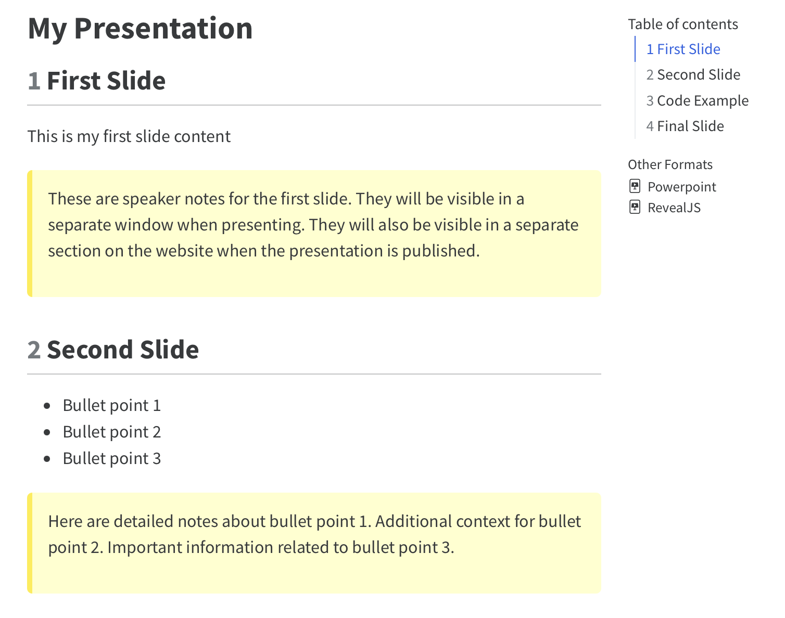

# quarto-slides-template

Purpose: Create a template that:

- Has the OSC look-and-feel for the presentation slides
- Slides (L1 & L2 material) are exported in four formats:
  - Online slides (format:reveal.js)
  - Online continuous html (format:html) with speaker notes visible (to make it more a book)
  - pptx export (for instructors to download for their own use). Many instructors want to adapt the slides to their use case, but usually won’t back-propagate their local changes to the repository (and usually we don’t want their changes).
  - pdf export

The CSS in the YAML styles the speaker notes (currently with the yellow background) when they are rendered in the continuous website. (CSS can also be put into a separate file).

When you render the html version, the other formats are provided as download links on the right sidebar:

